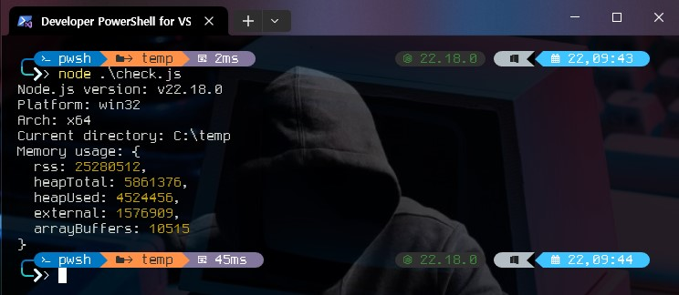

# Express를 빠르게 배우는 1일 학습

> Node.js의 backend의 기본인 Express를 체화하기 위한 1일 학습과정. 하루 1개씩 학습 및 정리(빌드)하며 체화하는 과정.

# 먼저 할 일

### 1. node.js 설치하기(개발환경 설치)

- Node.js 설치: [공식 사이트](https://nodejs.org/ko/)
- 패키지 관리자(NPM): Node.js 설치 시 기본 포함되며, 외부 라이브러리 설치/실행 스크립트 관리에 사용하는 매우 중요한 툴.
- 에디터/IDE: [Visual Studio Code](https://code.visualstudio.com/) 강추
- 실행 확인: node -v, npm -v 명령으로 정상 설치 여부를 확인.
- 추가 툴: nodemon(자동 재시작), eslint(코드 검사) 등을 설치해 개발 효율을 높일 수 있다.

### 2. 간단한 예제 실행하기

아래 소스를 작성
-  check.js

```javascript
console.log("Node.js version:", process.version);
console.log("Platform:", process.platform);
console.log("Arch:", process.arch);
console.log("Current directory:", process.cwd());
console.log("Memory usage:", process.memoryUsage());

```

콘솔에서 실행 

```bash
node check.js

```




# Day 1 — 1.1 Node.js란?

## 1) 기본설명

Node.js는 크롬 V8 엔진 위에서 동작하는 서버 사이드 JavaScript 런타임으로, 비동기 이벤트 기반/논블로킹 I/O 모델 덕분에 동시 요청 처리에 강점있다. `브라우저 밖에서 JS를 실행`할 수 있게 하며, API 서버·실시간 서비스 등에서 널리 사용된다. 

주요 특징은 다음과 같다. 
- 빠른 처리 속도(V8) 
- 방대한 NPM 생태계 
- 크로스플랫폼 지원

## 2) 코드 중심의 활용예제


아래는 Node.js 표준 `http` 모듈로 만든 최소 웹서버 예제이다(Express 없이 동작).

```js
// app.js
const http = require('http');

const server = http.createServer((req, res) => {
  res.statusCode = 200;           // 200 OK
  res.end('Hello, Node.js!');     // 간단 응답
});

server.listen(3000, () => {
  console.log('Server running at http://localhost:3000/');
});
```

-   실행:
    ```bash
    node -v   # Node.js 버전 확인
    npm -v    # npm 버전 확인
    node app.js
    ```
-   접속: [http://localhost:3000/](http://localhost:3000/) (브라우저에서 “Hello, Node.js!” 확인) 

## 3) 데스크탑에서 빌드할 수 있는 예제

### (a) 프로젝트 전체구조

```
src/1/
├─ package.json
└─ app.js            # Node 기본 HTTP 서버
```

### (b) 각 소스별 주석설명

- `app.js`
  - `http.createServer(...)`: 요청(req)과 응답(res)을 받아 200 응답과 문자열 본문을 전송한다.
  - `server.listen(3000, ...)`: 3000 포트로 수신 대기 후 콘솔 로그 출력.
- `package.json` (예시)

```json
{
  "name": "node-basics",
  "version": "1.0.0",
  "main": "app.js",
  "scripts": {
    "start": "node app.js"
  }
}
```

### (c) 빌드방법


1.  Node.js LTS 설치 및 버전 확인: `node -v`, `npm -v` 
2.  프로젝트 초기화(옵션): `npm init -y`
3.  실행: `npm start` 또는 `node app.js`
4.  브라우저에서 `http://localhost:3000/` 접속해 동작 확인.


## 4) 문제(3항)

```
1.  빈칸 채우기:  
    “Node.js는 ____ 기반의 ____ I/O 모델을 사용해 다수의 동시 요청을 효율적으로 처리한다.” 
2.  O/X: “Node.js는 브라우저 내부에서만 JavaScript를 실행할 수 있게 해준다.”
3.  단답: `http.createServer` 콜백의 두 인자는 각각 무엇을 의미하나?

```


# Day 2 — 1.2 Node.js의 특징 (이벤트 루프 & 논블로킹 I/O)


## 1) 기본설명


- **단일 스레드 JS + 이벤트 루프**: 애플리케이션의 JS 코드는 기본적으로 단일 스레드에서 돌지만, **이벤트 루프**가 작업 대기열을 효율적으로 처리
- **논블로킹 I/O**: 파일/네트워크 I/O는 OS 통지와 내부 스레드풀을 활용해 **대기 없이** 진행되어, 다수의 동시 요청에 강하다
- **비동기 프로그래밍 모델**: 콜백, Promise, `async/await` 등으로 고성능 비동기를 간결히 표현한다
- **빠른 실행(V8) + 거대한 생태계(NPM)**: JIT 최적화와 방대한 패키지로 개발/배포가 빠르다
- **스트리밍/버퍼 친화적**: 대용량 데이터 처리에 유리하다


## 2) 코드 중심의 활용예제


동일한 3개의 파일을 **동시에(비동기)** 읽을 때와 **순차적으로(동기)** 읽을 때의 시간을 비교한다.

```js
// main.js (발췌) — 실행: node main.js async  또는 node main.js sync
import { readFile } from 'node:fs/promises';
import { readFileSync } from 'node:fs';
import { performance } from 'node:perf_hooks';

const files = ['data/file1.bin', 'data/file2.bin', 'data/file3.bin'];

async function asyncRead() {
  const t0 = performance.now();
  const bufs = await Promise.all(files.map(f => readFile(f)));
  const total = bufs.reduce((n, b) => n + b.length, 0);
  const t1 = performance.now();
  console.log(`[ASYNC] bytes=${total} time=${(t1 - t0).toFixed(1)}ms`);
}

function syncRead() {
  const t0 = performance.now();
  let total = 0;
  for (const f of files) total += readFileSync(f).length; // 순차적 I/O
  const t1 = performance.now();
  console.log(`[SYNC]  bytes=${total} time=${(t1 - t0).toFixed(1)}ms`);
}

const mode = process.argv[2] || 'async';
mode === 'sync' ? syncRead() : asyncRead();
```

핵심 포인트

- `Promise.all`로 **동시에 읽기** → 이벤트 루프가 대기 시간 동안 다른 작업을 처리.
- `readFileSync`는 **대기하며 블로킹** → 다음 파일로 못 넘어감.

## 3) 데스크탑에서 빌드할 수 있는 예제

### (a) 프로젝트 전체구조

```
src/2/
├─ package.json
├─ generate.js         # 더미 파일 생성 (각 2MB)
├─ main.js             # async vs sync 파일 읽기 비교
└─ data/               # 생성된 파일 저장 경로
```

### (b) 각 소스별 주석설명

**package.json**

```json
{
  "name": "node-features",
  "version": "1.0.0",
  "type": "module",
  "scripts": {
    "gen": "node generate.js",
    "async": "node main.js async",
    "sync": "node main.js sync",
    "bench": "npm run async && npm run sync"
  }
}
```

- `"type": "module"`: ESM 사용.
- `gen/async/sync/bench` 스크립트 제공.

**generate.js**

```js
// 더미 파일 3개를 data/ 아래에 생성 (각 2MB)
import { mkdir, writeFile } from 'node:fs/promises';

const sizesMB = [2, 2, 2];
await mkdir('data', { recursive: true });

for (let i = 0; i < sizesMB.length; i++) {
  const size = sizesMB[i] * 1024 * 1024;
  const buf = Buffer.alloc(size, i); // 내용은 0x00,0x01,0x02...
  const path = `data/file${i + 1}.bin`;
  await writeFile(path, buf);
  console.log(`Created ${path} (${sizesMB[i]}MB)`);
}
console.log('Done.');
```

- `Buffer.alloc`으로 원하는 크기의 파일 생성.
- 테스트 데이터를 로컬에서 즉시 준비.

**main.js**

```js
// async(기본) 또는 sync 모드로 3개 파일 읽기 성능 비교
import { readFile } from 'node:fs/promises';
import { readFileSync } from 'node:fs';
import { performance } from 'node:perf_hooks';

const files = ['data/file1.bin', 'data/file2.bin', 'data/file3.bin'];

async function asyncRead() {
  const t0 = performance.now();
  const bufs = await Promise.all(files.map(f => readFile(f)));
  const total = bufs.reduce((n, b) => n + b.length, 0);
  console.log(`[ASYNC] bytes=${total} time=${(performance.now() - t0).toFixed(1)}ms`);
}

function syncRead() {
  const t0 = performance.now();
  let total = 0;
  for (const f of files) total += readFileSync(f).length;
  console.log(`[SYNC]  bytes=${total} time=${(performance.now() - t0).toFixed(1)}ms`);
}

const mode = process.argv[2] || 'async';
if (mode === 'sync') syncRead();
else asyncRead();
```

-  **비동기 버전**은 `Promise.all`로 **동시에** 읽어서 장치 대기 시간이 병목된다.
-  **동기 버전**은 파일당 대기 시간이 **누적**된다.

### (c) 빌드방법

> 별도 빌드 없음(런타임 실행). Node.js만 설치되어 있으면 OK

```bash
# 1) 프로젝트 생성 & 의존성(없음)

# 2) 소스 파일 저장 (generate.js / main.js 내용 붙여넣기)

# 3) 테스트 파일 생성
npm run gen

# 4) 벤치마크 실행
npm run bench
# [ASYNC] ... ms
# [SYNC]  ... ms  
# 결과는 비동기가 언제나 빠른 것은 아니다.  
# 과부하가 없다면 동기가 빠를 수 있다. 
```


## 4) 문제(3항)
```
1. 빈칸 채우기:  
    Node.js는 ______ 기반의 ______ I/O 모델을 사용하여 대기 시간을 최소화한다.
2.  O/X:  
    “동기식 파일 읽기(`readFileSync`)는 이벤트 루프를 블로킹한다.”
3.  단답:  
    Promise.all([...])을 사용해 여러 파일을 읽을 때 성능이 향상되는 이유를 
    한 문장으로 설명하시오.
```

# Day 3 — 2.1 Express.js 소개

## 1) 기본설명

Express.js는 Node.js 환경에서 가장 널리 사용되는 웹 애플리케이션 프레임워크.

-   **경량 & 유연성**: 최소한의 핵심만 제공하고, 필요한 기능은 미들웨어를 통해 확장.
-   **라우팅 시스템**: URL과 HTTP 메서드에 따라 요청을 처리할 수 있다.
-   **미들웨어 기반 아키텍처**: 요청 → 미들웨어 체인 → 응답 구조로 동작하여, 로깅, 인증, 에러 처리 등을 손쉽게 삽입할 수 있다.
-   **대규모 생태계**: 수많은 Express 호환 라이브러리와 튜토리얼, 커뮤니티가 존재한다.


## 2) 코드 중심의 활용예제

Express로 간단한 “Hello, Express” 서버 만들기:

```js
// server.js
const express = require('express');
const app = express();
const PORT = 3000;

// 루트 경로 GET 요청 처리
app.get('/', (req, res) => {
  res.send('Hello, Express!');
});

// /about 경로 추가
app.get('/about', (req, res) => {
  res.send('This is the About page.');
});

// 서버 실행
app.listen(PORT, () => {
  console.log(`Server running at http://localhost:${PORT}/`);
});
```

실행 후:

*   [http://localhost:3000/](http://localhost:3000/) → “Hello, Express!”
*   [http://localhost:3000/about](http://localhost:3000/about) → “This is the About page.”

* * *

## 3) 데스크탑에서 빌드할 수 있는 예제

### (a) 프로젝트 전체구조

```
src/3/
├─ package.json
└─ server.js
```

### (b) 각 소스별 주석설명

**package.json**

```json
{
  "name": "express-intro",
  "version": "1.0.0",
  "main": "server.js",
  "scripts": {
    "start": "node server.js"
  },
  "dependencies": {
    "express": "^4.18.2"
  }
}
```

*   `"dependencies"`에 Express 프레임워크 추가.

**server.js**

```js
// Express 불러오기
const express = require('express');
const app = express();
const PORT = 3000;

// 라우팅 예제
app.get('/', (req, res) => {
  res.send('Hello, Express!');
});

app.get('/about', (req, res) => {
  res.send('This is the About page.');
});

// 서버 실행
app.listen(PORT, () => {
  console.log(`Server running at http://localhost:${PORT}/`);
});
```

### (c) 빌드방법

```bash
# 1. 프로젝트 생성

# 2. Express 설치
npm install express

# 3. 서버 실행
npm start

# 4. 브라우저에서 접속
http://localhost:3000
```


### 4) 문제(3항)

```
1.  빈칸 채우기: Express.js는 ______ 기반 아키텍처를 통해 요청과 응답을 처리한다.
2.  O/X: Express.js는 Node.js에 내장된 표준 라이브러리이다.
3.  단답: Express 앱에서 HTTP GET 요청에 응답하려면 어떤 메서드를 사용해야 하는가?
```

# Day 4 — 2.2 Express.js 라우팅 기본

## 1) 기본설명

Express.js의 가장 핵심 기능 중 하나는 **라우팅(Routing)** 이다.  
라우팅은 클라이언트의 **HTTP 메서드(GET, POST, PUT, DELETE 등)** 와 **URL 경로**에 따라 실행할 동작(핸들러 함수)을 정의하는 과정이다.

-   **라우트 구성 요소**
    -   HTTP 메서드 (예: `app.get`, `app.post`)
    -   경로 (예: `'/'`, `'/users'`)
    -   핸들러 함수 `(req, res) => {...}`
-   **특징**
    -   직관적이며 코드 가독성이 높음
    -   정규식 기반 경로 지정 가능
    -   파라미터와 쿼리스트링을 쉽게 처리 가능


## 2) 코드 중심의 활용예제

기본 라우팅 예제:

```js
// routes.js
const express = require('express');
const app = express();
const PORT = 3000;

// GET /
app.get('/', (req, res) => {
  res.send('홈 페이지');
});

// GET /user/:id
app.get('/user/:id', (req, res) => {
  const userId = req.params.id;  // URL 파라미터
  res.send(`사용자 ID: ${userId}`);
});

// POST /login
app.post('/login', (req, res) => {
  res.send('로그인 요청 처리');
});

app.listen(PORT, () => {
  console.log(`Server running at http://localhost:${PORT}/`);
});
```

## 3) 데스크탑에서 빌드할 수 있는 예제

### (a) 프로젝트 전체구조

```
src/4/
├─ package.json
├─ routes.js
└─ testclient.txt 
```

### (b) 각 소스별 주석설명

**package.json**

```json
{
  "name": "express-routing",
  "version": "1.0.0",
  "main": "routes.js",
  "scripts": {
    "start": "node routes.js"
  },
  "dependencies": {
    "express": "^4.18.2"
  }
}
```

*   `express`를 의존성에 추가.
*   `npm start` 실행 시 `routes.js` 실행.

**routes.js**

```js
// Express 불러오기
const express = require('express');
const app = express();
const PORT = 3000;

// 루트 경로
app.get('/', (req, res) => {
  res.send('홈 페이지');
});

// URL 파라미터 예제 (/user/123 → "사용자 ID: 123")
app.get('/user/:id', (req, res) => {
  res.send(`사용자 ID: ${req.params.id}`);
});

// POST 요청 처리 (/login)
app.post('/login', (req, res) => {
  res.send('로그인 요청 처리');
});

// 서버 시작
app.listen(PORT, () => {
  console.log(`Server running at http://localhost:${PORT}/`);
});
```

### (c) 빌드방법

```bash
# 1. 프로젝트 생성

# 2. Express 설치
npm install express

# 3. 서버 실행
npm start

# 4. 테스트(testclient.txt)
curl http://localhost:3000/
curl http://localhost:3000/user/101
curl -X POST http://localhost:3000/login
```


4) 문제(3항)

```
1.  빈칸 채우기: Express 라우팅은 HTTP ______와 URL ______를 조합하여 요청을 처리한다.
2.  O/X: `app.get('/user/:id', ...)`에서 `:id`는 URL 파라미터를 의미한다.
3.  단답: POST 요청을 처리하기 위해 사용하는 Express 메서드는 무엇인가?
```


# Day 5 — 2.3 Express.js 미들웨어 기본

## 1) 기본설명

Express.js의 \*\*미들웨어(Middleware)\*\*는 요청(Request)과 응답(Response) 사이에서 실행되는 함수.

-   **동작 원리**: `req`와 `res` 객체를 조작하거나, 로깅·인증·에러처리 같은 공통 기능을 수행한 뒤 `next()`를 호출하여 다음 미들웨어/라우터로 제어를 넘긴다.
-   **형식**: `(req, res, next) => { ... }`
-   **종류**
    *   애플리케이션 레벨 미들웨어: `app.use(...)`로 등록
    *   라우터 레벨 미들웨어: 특정 라우터에만 적용
    *   에러 처리 미들웨어: `(err, req, res, next)` 형태
-   **활용 예시**: 요청 로깅, Body 파싱, 인증/인가, 정적 파일 제공


## 2) 코드 중심의 활용예제

간단한 로깅 미들웨어와 라우팅 적용:

```js
// middleware-example.js
const express = require('express');
const app = express();
const PORT = 3000;

// 애플리케이션 레벨 미들웨어
app.use((req, res, next) => {
  console.log(`[${new Date().toISOString()}] ${req.method} ${req.url}`);
  next(); // 다음 핸들러로 이동
});

// 라우트
app.get('/', (req, res) => {
  res.send('홈 페이지');
});

app.get('/about', (req, res) => {
  res.send('소개 페이지');
});

// 에러 처리 미들웨어
app.use((err, req, res, next) => {
  console.error(err.stack);
  res.status(500).send('서버 에러 발생');
});

app.listen(PORT, () => {
  console.log(`Server running at http://localhost:${PORT}/`);
});
```


## 3) 데스크탑에서 빌드할 수 있는 예제

### (a) 프로젝트 전체구조

```
src/5/
├─ package.json
└─ middleware.js
```

### (b) 각 소스별 주석설명

**package.json**

```json
{
  "name": "express-middleware",
  "version": "1.0.0",
  "main": "middleware.js",
  "scripts": {
    "start": "node middleware.js"
  },
  "dependencies": {
    "express": "^4.18.2"
  }
}
```

**middleware.js**

```js
// Express 불러오기
const express = require('express');
const app = express();
const PORT = 3000;

// 로깅 미들웨어 (모든 요청에 적용)
app.use((req, res, next) => {
  console.log(`[LOG] ${req.method} ${req.url}`);
  next();
});

// 라우팅
app.get('/', (req, res) => {
  res.send('홈 페이지');
});

app.get('/about', (req, res) => {
  res.send('소개 페이지');
});

// 에러 처리 미들웨어
app.use((err, req, res, next) => {
  console.error('Error stack:', err.stack);
  res.status(500).send('에러가 발생했습니다.');
});

// 서버 시작
app.listen(PORT, () => {
  console.log(`Server running at http://localhost:${PORT}/`);
});
```

### (c) 빌드방법

```bash
# 1. 프로젝트 생성

# 2. Express 설치
npm install express

# 3. 서버 실행
npm start

# 4. 브라우저/터미널에서 확인(testclinet.txt)
curl http://localhost:3000/
curl http://localhost:3000/about
```

실행 시 콘솔에 `[LOG] GET /` 같은 로그가 출력됨.

* * *

4) 문제(3항)
---------

1.  빈칸 채우기: Express 미들웨어는 `(req, res, ______)` 형식의 함수를 기본으로 한다.
2.  O/X: 미들웨어에서 `next()`를 호출하지 않으면 요청 처리가 다음 단계로 넘어가지 않는다.
3.  단답: 에러 처리 미들웨어 함수의 매개변수는 몇 개인가?


# Day 6 — 2.4 Express.js 정적 파일 제공

## 1) 기본설명

Express.js는 \*\*정적 파일(static files)\*\*을 쉽게 서비스할 수 있는 기능을 제공한다. 

-   **정적 파일**: HTML, CSS, JS, 이미지, 폰트 등 서버에서 가공 없이 그대로 클라이언트로 전달되는 리소스.
-   **`express.static` 미들웨어**: 특정 디렉토리를 정적 파일 제공 경로로 지정할 수 있음.
-   **활용 예시**:
    -   웹사이트의 CSS·이미지 배포
    -   프론트엔드 SPA(React, Vue) 빌드 파일 제공
    -   단순 정적 리소스 공유


## 2) 코드 중심의 활용예제

```js
// static-example.js
const express = require('express');
const path = require('path');
const app = express();
const PORT = 3000;

// "public" 디렉토리를 정적 파일 제공 경로로 지정
app.use(express.static(path.join(__dirname, 'public')));

// 라우트 (테스트용)
app.get('/', (req, res) => {
  res.send('정적 파일 예제 서버');
});

app.listen(PORT, () => {
  console.log(`Server running at http://localhost:${PORT}/`);
});
```

-   `http://localhost:3000/style.css` 요청 시 `public/style.css` 파일 자동 제공
-   `http://localhost:3000/images/logo.png` 요청 시 `public/images/logo.png` 제공


## 3) 데스크탑에서 빌드할 수 있는 예제

### (a) 프로젝트 전체구조

```
src/6/
├─ package.json
├─ static.js
└─ public/
   ├─ index.html
   ├─ style.css
   └─ images/
      └─ logo.png
```

### (b) 각 소스별 주석설명

**package.json**

```json
{
  "name": "express-static",
  "version": "1.0.0",
  "main": "static.js",
  "scripts": {
    "start": "node static.js"
  },
  "dependencies": {
    "express": "^4.18.2"
  }
}
```

**static.js**

```js
// Express 및 path 모듈 불러오기
const express = require('express');
const path = require('path');
const app = express();
const PORT = 3000;

// public 디렉토리 내 파일을 정적 리소스로 제공
app.use(express.static(path.join(__dirname, 'public')));

// 기본 라우트
app.get('/', (req, res) => {
  res.send('정적 파일 서버 실행 중');
});

// 서버 시작
app.listen(PORT, () => {
  console.log(`Server running at http://localhost:${PORT}/`);
});
```

**public/index.html**

```html
<!DOCTYPE html>
<html lang="ko">
<head>
  <meta charset="UTF-8">
  <title>정적 파일 예제</title>
  <link rel="stylesheet" href="/style.css">
</head>
<body>
  <h1>Express 정적 파일 제공</h1>
  
</body>
</html>
```

**public/style.css**

```css
body {
  font-family: sans-serif;
  background-color: #f4f4f4;
  text-align: center;
}
h1 {
  color: #2c3e50;
}
```

### (c) 빌드방법

```bash
# 1. 프로젝트 생성

# 2. Express 설치
npm install express

# 3. public 디렉토리 및 예제 파일 생성
# (index.html, css, logo.png)

# 4. 서버 실행
npm start

# 5. 브라우저에서 확인
http://localhost:3000/index.html
```


### 4) 문제(3항)

```
1.  빈칸 채우기: Express에서 정적 파일을 제공할 때 사용하는 내장 미들웨어는 `express.______` 이다.
2.  O/X: `express.static`을 사용하면 지정한 디렉토리 내 파일들이 URL을 통해 바로 접근 가능하다.
3.  단답: `public` 폴더 안에 있는 `style.css`를 브라우저에서 불러오려면 어떤 URL로 접근해야 하는가?
```

# Day 7 — 2.5 Express.js 요청과 응답 객체

## 1) 기본설명

Express.js에서 모든 라우트 핸들러는 두 가지 핵심 객체를 인자로 받는다.

*   **요청 객체 (`req`)**: 클라이언트가 보낸 HTTP 요청의 정보(헤더, 파라미터, 쿼리스트링, 바디 등)를 포함.
*   **응답 객체 (`res`)**: 서버에서 클라이언트로 보낼 응답을 제어. 텍스트/JSON 응답, 상태 코드 지정, 리다이렉트 등 다양한 메서드 제공.

**주요 `req` 속성**

*   `req.params`: URL 파라미터
*   `req.query`: 쿼리스트링 파라미터
*   `req.body`: POST/PUT 요청 본문(BodyParser나 express.json() 필요)
*   `req.headers`: 요청 헤더

**주요 `res` 메서드**

*   `res.send()`: 문자열, 버퍼, 객체 등을 응답
*   `res.json()`: JSON 응답
*   `res.status()`: HTTP 상태 코드 설정
*   `res.redirect()`: 다른 URL로 리다이렉트


## 2) 코드 중심의 활용예제

```js
// req-res-example.js
const express = require('express');
const app = express();
const PORT = 3000;

// JSON body 파싱 미들웨어
app.use(express.json());

// GET /user/:id 요청 → params, query 확인
app.get('/user/:id', (req, res) => {
  const id = req.params.id;
  const sort = req.query.sort;
  res.send(`User ID: ${id}, sort: ${sort || 'none'}`);
});

// POST /login 요청 → body 확인
app.post('/login', (req, res) => {
  const { username, password } = req.body;
  if (username === 'admin' && password === '1234') {
    res.json({ success: true, message: '로그인 성공' });
  } else {
    res.status(401).json({ success: false, message: '로그인 실패' });
  }
});

// 리다이렉트 예제
app.get('/old-route', (req, res) => {
  res.redirect('/new-route');
});
app.get('/new-route', (req, res) => {
  res.send('이곳은 새로운 경로입니다.');
});

app.listen(PORT, () => {
  console.log(`Server running at http://localhost:${PORT}/`);
});
```


## 3) 데스크탑에서 빌드할 수 있는 예제

### (a) 프로젝트 전체구조

```
src/7
├─ package.json
├─ req-res.js
└─ README.md
```

### (b) 각 소스별 주석설명

**package.json**

```json
{
  "name": "express-req-res",
  "version": "1.0.0",
  "main": "req-res.js",
  "scripts": {
    "start": "node req-res.js"
  },
  "dependencies": {
    "express": "^4.18.2"
  }
}
```

**req-res-example.js**

```js
const express = require('express');
const app = express();
const PORT = 3000;

// JSON 형식 body 파싱을 위한 미들웨어
app.use(express.json());

// URL 파라미터와 쿼리 사용
app.get('/user/:id', (req, res) => {
  res.send(`User ID: ${req.params.id}, sort: ${req.query.sort || 'none'}`);
});

// POST body 확인
app.post('/login', (req, res) => {
  const { username, password } = req.body;
  if (username === 'admin' && password === '1234') {
    res.json({ success: true, message: '로그인 성공' });
  } else {
    res.status(401).json({ success: false, message: '로그인 실패' });
  }
});

// 리다이렉트
app.get('/old-route', (req, res) => {
  res.redirect('/new-route');
});
app.get('/new-route', (req, res) => {
  res.send('이곳은 새로운 경로입니다.');
});

// 서버 실행
app.listen(PORT, () => {
  console.log(`Server running at http://localhost:${PORT}/`);
});
```

### (c) 빌드방법

```bash
# 1. 프로젝트 생성

# 2. Express 설치
npm install express

# 3. 서버 실행
npm start

# 4. 테스트
curl http://localhost:3000/user/101?sort=desc
curl -X POST http://localhost:3000/login -H "Content-Type: application/json" -d '{"username":"admin","password":"1234"}'
curl -v http://localhost:3000/old-route
```


## 4) 문제(3항)

```
1.  빈칸 채우기: `req.params`, `req.query`, `req.body`는 각각 ______, ______, ______ 데이터를 담는다.
2.  O/X: `res.status(404).send('Not Found')`는 상태 코드와 메시지를 동시에 전송할 수 있다.
3.  단답: 클라이언트를 다른 URL로 이동시키는 데 사용하는 `res` 메서드는 무엇인가?
```


